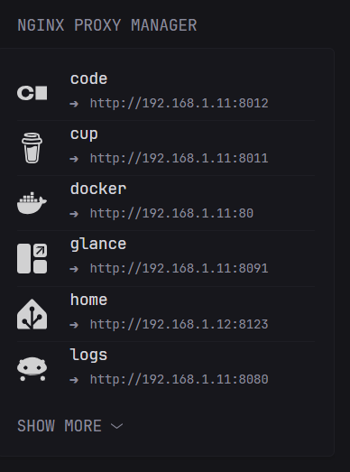
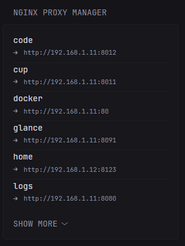

# Nginx Proxy Manager

A Widget to show current Nginx Proxy Configration, click the subdomain name or the host ip to land into corrospnding pages

| Horizontal Widget               |               Verical Widget                |
| ------------------------------- | :-----------------------------------------: |
|  |  |

#### Configuration

```yaml
- type: custom-api
  title: Nginx Proxy Manager
  cache: 12h
  url: ${NGINX_PROXY_URL}/api/tokens
  method: POST
  body-type: json
  body:
    identity: ${NGINX_EMAIL_ID}
    secret: ${NGINX_PASSWORD}
  options:
    collapse-after: 6
    show-icons: true
    domain-name: ".example.com" # this is your top level DNS domain name
    tooltip-enabled: true
    #  if you want custom icons add here [either simple icon id or full url]
    code: coder
    paperless: paperlessngx
    docker: docker
    glance: https://cdn.jsdelivr.net/gh/selfhst/icons/svg/glance-dark.svg
    portainer: portainer

  template: |
    <style>
      .widget-type-nginx li {
        margin-top: var(--list-half-gap); 
        border-top: 1px solid var(--color-separator);
        padding-top: var(--list-half-gap);
      }
      .widget-ngix-proxy-icon, .widget-ngix-proxy-icon-default  {
        display: block;
        filter: grayscale(0.4);
        object-fit: contain;
        aspect-ratio: 1 / 1;
        width: 2.7rem;
        opacity: 0.8;
        transition: filter 0.3s, opacity 0.3s;
      }
      // DISABLE THE BELOW CSS FOR COLOR ICONS 
      :root[data-scheme="dark"] .widget-ngix-proxy-icon {
        filter: invert(100%); // this to invert colors for dark and light theme 
      } 
    </style>

    {{ $defaultIconUrl := "https://raw.githubusercontent.com/NginxProxyManager/nginx-proxy-manager/refs/heads/develop/docs/src/public/logo.svg" }}
       
    {{ if eq .Response.StatusCode 200 }}
      {{ $accessToken := .JSON.String "token" }}
      {{
        $proxyHosts := newRequest (concat "${NGINX_PROXY_URL}" "/api/nginx/proxy-hosts")
          | withHeader "Authorization" (print "Bearer " $accessToken)
          | getResponse
      }}
      <ul  class="dynamic-columns list list-gap-15 list-with-separator  collapsible-container"  data-collapse-after="{{ .Options.IntOr "collapse-after" 6 }}">
        {{ range $proxyHosts.JSON.Array "" }}
          {{ if and (.String "domain_names.0") (.Bool "enabled")  }}
            
            {{ $proxy_url  := (concat (.String "forward_scheme") "://" (.String "domain_names.0") ) }}
            {{ $host_url   := (concat (.String "forward_scheme") "://" (.String "forward_host") ":" (.String "forward_port") ) }}
            {{ $subDomain  := .String "domain_names.0" | trimSuffix ($.Options.StringOr "domain-name" "") }}

            <li class="flex items-center gap-20" >
              <!-- Icon Section -->
              {{ if $.Options.BoolOr "show-icons" true }}
                <div class="shrink-0">
                    {{ $iconUrl := $.Options.StringOr $subDomain $defaultIconUrl}}
                    {{ if eq $iconUrl $defaultIconUrl }}
                      
                    {{ else }}
                      {{ if ne (findMatch "://" $iconUrl)  "://" }} <!-- check if url is NOT provided -->
                        
                      {{ else }}
                        
                      {{ end }}
                    {{ end }}
                </div>
              {{ end }}

              <!-- Proxy URLs Section -->
              <div class="min-width-0 grow">
                <a href='{{ $proxy_url }}' class="color-highlight size-title-dynamic block" style="display: inline;" target="_blank" rel="noreferrer"
                    {{if $.Options.BoolOr "tooltip-enabled" false}}data-popover-type="text" data-popover-text="{{$proxy_url}}"{{end}}
                  >{{ $subDomain }}</a>
                <div class="flex items-center gap-10" style="margin-bottom: 5px">
                  <div class="text-left">
                        ➔
                  </div>
                  <div class="size-h6 flex-1 text-left">
                    <a href='{{ $host_url }}' target="_blank" rel="noreferrer">{{ $host_url }}</a>
                  </div>
                </div>
              </div>
            </li>
          {{ end }}
        {{ end }}
      </ul>

    {{ else }}
      <p class='color-negative'>Failed to get token: {{ .JSON.String "error.message" }} ({{ $.Response.Status }}) </p>
    {{ end }}
```

#### Options

##### Explantion of avalable Options:

- **collapse-after** : Number of proxies to show when page loads [Int]
- **show-icons** : Hide or show Icons [Booelan]
- **domain-name** : Top level DNS domain name, eg: In `https://homeassistant.example.com`; Here `.example.com` would be the domain name
- **tooltip-enabled** : Hide or show tooltip on subdomain name

For custom icon your need to enter in the following way :

- Key: Value [where Key is you sub domain ] & value is either Simple Icon ID from https://simpleicons.org/ or a full URL
- Provide dark url by default [check example below] based on the theme it would auto switch with light or dark

for coloured icon provide urls and remove the following css lines `:root[data-scheme="dark"] .widget-ngix-proxy-icon` [this disables auto invert]

To change the default icon update the $defaultIconUrl

##### Useage:

<table>
<tr>
<td>Configration Type</td>
<td>Preview</td>
</tr>

<tr>
<td>

`Default [minimal config]`

```yaml
options:
  collapse-after: 6
  show-icons: false
  domain-name: ".example.com" # this is your top level DNS domain name
  tooltip-enabled: true
```

</td>
<td>



</td>
</tr>

<tr>
<td>

`Default Icons`

```yaml
options:
  collapse-after: 6
  show-icons: true
  domain-name: ".example.com" # this is your top level DNS domain name
  tooltip-enabled: true
```

</td>
<td>


</td>
</tr>

<tr>
<td>

`Custom Icons`

```yaml
options:
  collapse-after: 6
  show-icons: true
  domain-name: ".example.com" # this is your top level DNS domain name
  tooltip-enabled: true
  #  if you want custom icons add here [either simple icon id from [https://simpleicons.org/] or full url]
  code: coder
  paperless: paperlessngx
  home: homeassistant
  cup: buymeacoffee
  docker: docker
  glance: https://cdn.jsdelivr.net/gh/selfhst/icons/svg/glance-dark.svg
  portainer: portainer
  proxy: nginxproxymanager
  pve: proxmox
  speedtest: speedtest
  logs: https://cdn.jsdelivr.net/gh/selfhst/icons/svg/dozzle-dark.svg
```

</td>
<td>


</td>
</tr>
</table>

#### Environment Variables

`NGINX_PROXY_URL` : Nginx Proxy Url of the hosted intance either the IP or domain name like https://proxy.example.com
`NGINX_EMAIL_ID` : Nginx Console login email id  
`NGINX_PASSWORD` : Nginx Console password
